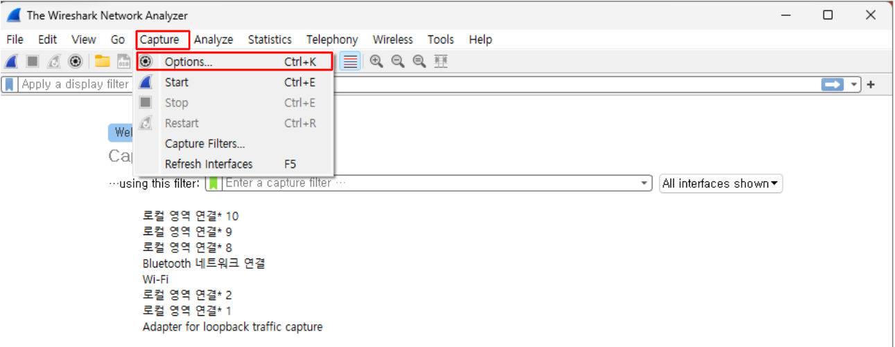
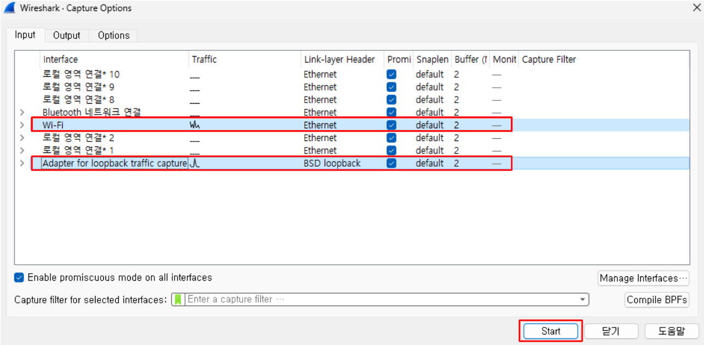
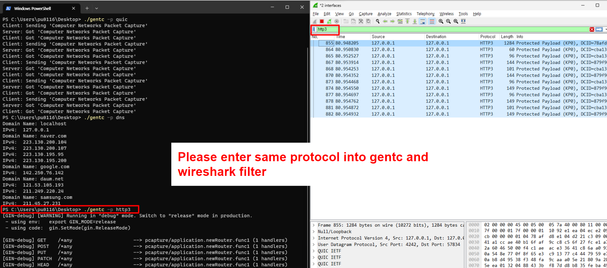
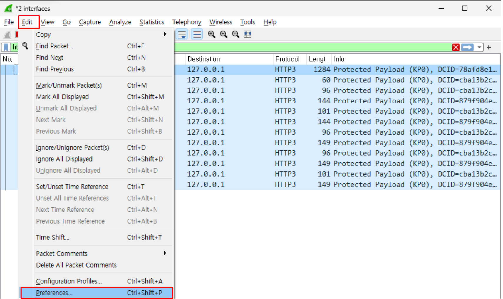

-> This repository is prepared for computer networks lecture

# Pre-required software
- Wireshark
- `gentc` application
    - Please download on [release page](https://github.com/iot-standards-laboratory/pcapsample/releases)

# How to use
- Execute wireshark
    - Select interface to capture including loopback (You can select multiple interface with `ctrl` key)

        
        

- Execute gentc (Use a terminal that is available on your system)
    - for mac or windows powershell
        ```bash
        ./gentc -p {protocol}
        ```
    - for windows cmd
        ```cmd
        gentc -p {protocol}
        ```
    - Example image
        - 

- For QUIC or HTTP, please import the keylog file generated by `gentc` in Wireshark
    - Edit -> Preferences -> Protocols -> TLS -> Browse -> Select keylog file
    
    
    
    